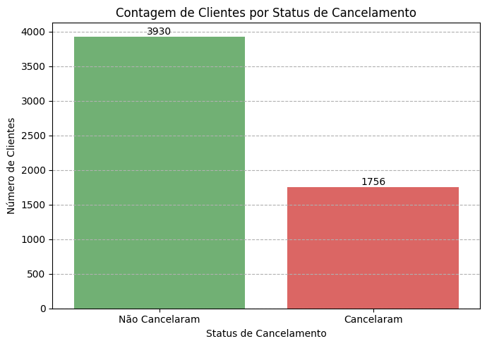
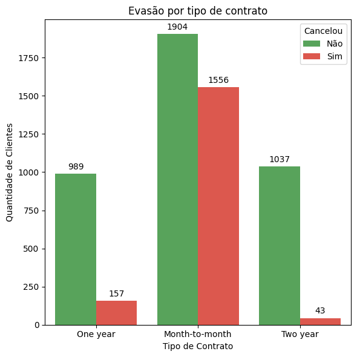
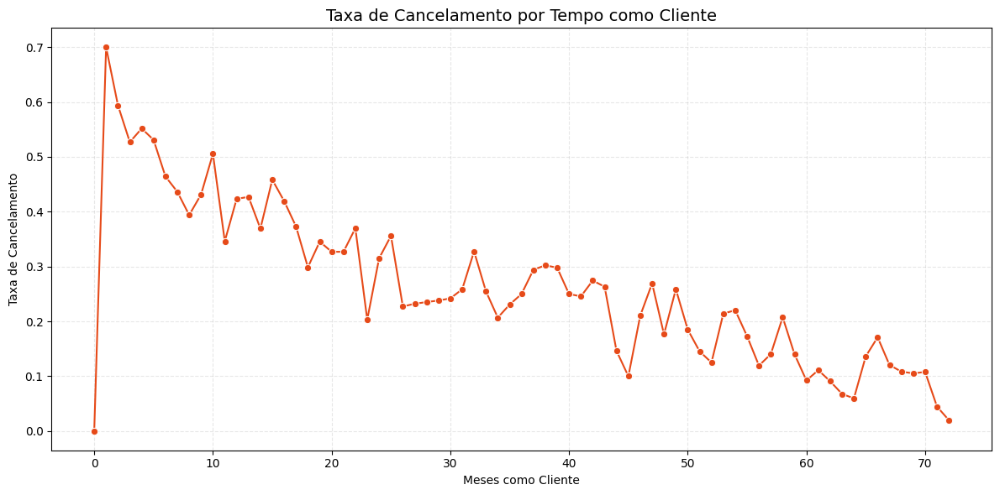

# ⚡ ETL e Análise de Evasão de Clientes 

Este projeto faz parte do *challenge* de ciência de dados da turma 8 do programa Oracle Next One.  
O objetivo foi praticar **processos de ETL (Extração, Transformação e Carga)** para tratar dados brutos e gerar insights sobre a **evasão (churn) de clientes** da empresa fictícia **Telecom X**.

---

## 📚 Tecnologias Utilizadas

O projeto foi desenvolvido em **Python** no Google Colab, utilizando as seguintes bibliotecas:

- **pandas** → manipulação e tratamento de dados.
- **matplotlib** e **seaborn** → visualização de dados.  
- **requests** → extração de dados de API/URL.

---

## 🔄 Processo ETL

1. **Extração**  
   - Os dados foram obtidos a partir de um arquivo JSON disponibilizado em um repositório público.

2. **Transformação**  
   - Normalização dos dados em formato tabular.  
   - Tratamento de valores nulos e duplicados.  
   - Conversão de variáveis categóricas em variáveis numéricas.  
   - Criação de novas colunas, como `contas_diarias`.  
   - Padronização de nomes de colunas para melhor legibilidade.

3. **Carga**  
   - Os dados tratados foram utilizados diretamente no notebook para gerar análises estatísticas e visuais.

---

## 📦 Conjunto de Dados

O dataset original está disponível em JSON e contém informações sobre clientes da **Telecom X**, incluindo:

- Dados demográficos (gênero, idade, dependentes etc.);  
- Serviços contratados (internet, telefone, streaming, suporte técnico etc.);  
- Informações de cobrança e pagamento;  
- Status de cancelamento (*churn*).

🔗 [Acessar dados brutos](https://raw.githubusercontent.com/ingridcristh/challenge2-data-science/refs/heads/main/TelecomX_Data.json)

---

## 📊 Exemplos de Visualizações

### Contagem de Clientes por Status de Cancelamento


### Evasão por Tipo de Contrato


### Taxa de Cancelamento por Tempo como Cliente


### Evasão por Forma de Pagamento


---

## 🧠 Principais Descobertas

Com base na análise dos dados tratados, os principais **insights** foram:

1. **Evasão por Gênero**  
   - Homens e mulheres apresentam taxas semelhantes → o gênero não é determinante para o cancelamento.

2. **Evasão por Idade**  
   - Clientes idosos cancelam ligeiramente mais, possivelmente por menor engajamento digital.

3. **Evasão por Tempo como Cliente**  
   - O **primeiro mês é crítico**: mais clientes cancelam do que permanecem.  
   - A fidelização aumenta com o tempo: após 72 meses, menos de 50 clientes cancelaram, contra mais de 350 que permaneceram.

4. **Evasão e Tipo de Internet**  
   - Clientes de fibra óptica cancelam mais que os de DSL, sugerindo problemas de expectativa ou qualidade percebida.

5. **Evasão e Tipo de Contrato**  
   - Contratos **mês a mês** apresentam maior taxa de churn.  
   - Contratos de longo prazo retêm melhor os clientes.

6. **Evasão e Serviços Adicionais**  
   - Clientes com **segurança online, backup, suporte técnico e proteção de dispositivo** cancelam menos.  

7. **Evasão e Valor Mensal**  
   - Quanto maior o valor da fatura mensal, maior a chance de cancelamento → indicando problemas de custo-benefício.

8. **Evasão e Forma de Pagamento**  
   - Clientes que usam **Electronic Check** apresentam taxa de evasão extremamente alta.

---

## 🔍 Conclusões

- **Perfil de alto risco**: clientes recém-chegados, com contrato mensal, sem serviços adicionais e pagando por Electronic Check.  
- **Perfil de retenção**: clientes de longo prazo, com serviços agregados e contratos de fidelidade.  
- Melhorar a **experiência inicial** (primeiro mês) e incentivar **planos de longo prazo** são estratégias-chave para reduzir a evasão.

---

## 🚀 Como Executar

1. **Clone ou baixe** este repositório.  
2. Abra o notebook `.ipynb` no [Google Colab](https://colab.research.google.com/) ou em Jupyter Notebook.  
3. Caso execute localmente, instale as dependências:  

```bash
pip install pandas numpy matplotlib seaborn requests
```

## 👤 Sobre o Autor

Meu nome é **Pedro Paulo**, sou estudante de **Sistemas de Informação**. Atualmente, estou aprofundando meus conhecimentos em **ciência e engenharia de dados**, com o objetivo de atuar como **Engenheiro de Dados**. Também tenho desenvolvido uma curiosidade crescente pela **Engenharia de Inteligência Artificial**, explorando como essas áreas podem se complementar.  

📌 Este projeto faz parte da minha jornada de aprendizado no programa **Oracle Next Education - Alura**.  


**Autor:** Pedro Paulo  
[🔗 LinkedIn](https://www.linkedin.com/in/olipedropaulo/)

